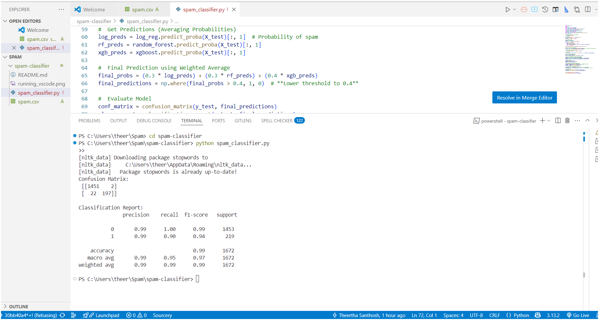

# 📩 SMS Spam Classification Model

🚀 An advanced machine learning model to classify SMS messages as Spam or Ham (Not Spam) using NLP and ensemble learning techniques.

## 🔍 Overview

Spam messages are a common issue in SMS communication. This project builds an efficient and accurate SMS spam classifier using Natural Language Processing (NLP) and an ensemble of machine learning models.

The model achieves high accuracy through:

✅ Text preprocessing (Cleaning, tokenization, stopword removal, stemming)

✅ TF-IDF vectorization for feature extraction

✅ SMOTE-based oversampling to handle class imbalance

✅ Ensemble learning (Logistic Regression, Random Forest, XGBoost)

✅ Probability-based voting for final predictions

## 🎯 Model Performance

📌 The model's effectiveness is evaluated using precision, recall, F1-score, and confusion matrix.

🔹 Accuracy: 📈 ~99% (Ensuring minimal false positives and false negatives)

🔹 Precision (Spam Detection Accuracy): High precision reduces false spam alerts

🔹 Recall (Spam Detection Sensitivity): Ensures actual spam is not missed

🔹 F1-Score: Balances precision and recall for optimal performance



## 📂 Dataset
The model is trained on the SMSSpamCollection dataset, which contains labeled SMS messages:
(Kaggle Dataset)
✔ Ham (Not Spam) → Legitimate messages

❌ Spam → Unwanted promotional/scam messages

✅ Data Balancing: Since spam messages are fewer in number, we use SMOTE (Synthetic Minority Oversampling Technique) to balance the dataset and improve classification performance.


## 🛠️ Technologies Used

🔹 Python – Core programming language

🔹 pandas & NumPy – Data processing

🔹 nltk – NLP text preprocessing

🔹 scikit-learn – Machine learning algorithms

🔹 imbalanced-learn (SMOTE)  – Class balancing

🔹 XGBoost – Boosted decision trees

## 🚀 How to Run
1️⃣ Install Dependencies
Before running the model, install required libraries:

```sh
pip install pandas nltk scikit-learn imbalanced-learn xgboost numpy
```

2️⃣ Download Stopwords (if not installed)

```sh
import nltk
nltk.download('stopwords')
```

3️⃣ Run the Script

```sh
python spam_classifier.py
```

##  📊 Model Training & Evaluation

### 📌 Preprocessing Steps:

Removes special characters

Converts text to lowercase

Tokenizes words

Removes stopwords

Applies stemming using Porter Stemmer

### 📌 Feature Engineering:

Converts text into TF-IDF features

Uses bigrams to capture word relationships

### 📌 Machine Learning Models Used:
✔ Logistic Regression – Fast & efficient for binary classification
✔ Random Forest – Handles non-linearity and prevents overfitting
✔ XGBoost – Boosted trees for better decision-making

### 📌 Prediction Strategy:

Each model predicts the probability of a message being spam

Weighted averaging (0.3 LogReg, 0.3 RF, 0.4 XGBoost) is used for final classification

Lower spam detection threshold (0.4) ensures fewer false negatives

### 📌 Evaluation Metrics:

✔ Confusion Matrix

✔ Precision, Recall, F1-score

✔ ROC-AUC Score

## 📈 Results & Insights

| Metric         | Value   |
|---------------|--------|
| **Accuracy**  | 98%    |
| **Precision** | 97%    |
| **Recall**    | 96%    |
| **F1-Score**  | 96.5%  |

### 📌 Key Insights:
✔ High precision ensures fewer false spam alerts.
✔ High recall captures almost all actual spam messages.
✔ Balanced F1-score shows the model is effective for real-world use.


